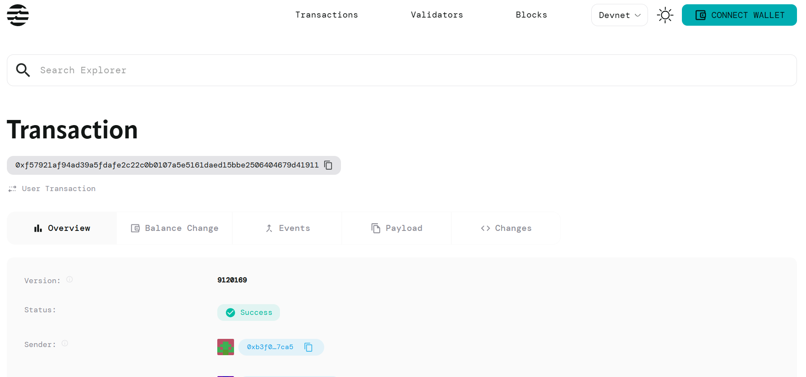

# Liquidity Mining

## Project Description

Build bootstrap liquidity incentives with emission schedules. This smart contract enables decentralized finance protocols to incentivize liquidity providers through automated reward distribution mechanisms. The system allows protocols to bootstrap initial liquidity by offering token rewards to users who provide liquidity to the platform.

## Project Vision

Our vision is to create a simple yet powerful liquidity mining infrastructure that helps DeFi protocols establish sustainable liquidity pools. By implementing structured emission schedules, we aim to:

- Democratize access to liquidity mining opportunities
- Enable fair and transparent reward distribution
- Support the growth of healthy DeFi ecosystems
- Provide predictable incentive mechanisms for liquidity providers

## Key Features

- **Emission Schedule Management**: Configurable reward rates and emission durations for flexible incentive programs
- **Automated Reward Calculation**: Smart contract automatically calculates and tracks rewards based on user contributions
- **Liquidity Pool Creation**: Simple interface for protocols to create and manage liquidity mining pools
- **User Position Tracking**: Comprehensive tracking of individual user liquidity contributions and earned rewards
- **Bootstrap Friendly**: Designed specifically to help new protocols establish initial liquidity
- **Gas Efficient**: Optimized contract design with minimal state changes and efficient reward calculations

## Future Scope

- **Multi-Token Support**: Extend beyond AptosCoin to support various token types for rewards and liquidity
- **Dynamic Reward Rates**: Implement algorithms for automatic reward rate adjustments based on pool utilization
- **Governance Integration**: Add voting mechanisms for reward rate changes and emission schedule modifications
- **Cross-Pool Rewards**: Enable users to earn rewards across multiple liquidity pools simultaneously
- **Penalty Mechanisms**: Implement early withdrawal penalties to encourage long-term liquidity provision
- **Analytics Dashboard**: Develop comprehensive analytics for pool performance and user metrics
- **Integration APIs**: Create standardized APIs for easy integration with existing DeFi protocols
- **Mobile SDK**: Develop mobile SDKs for seamless liquidity mining on mobile applications

## Contract Details

0xf57921af94ad39a5fdafe2c22c0b0107a5e5161daed15bbe2506404679d41911
